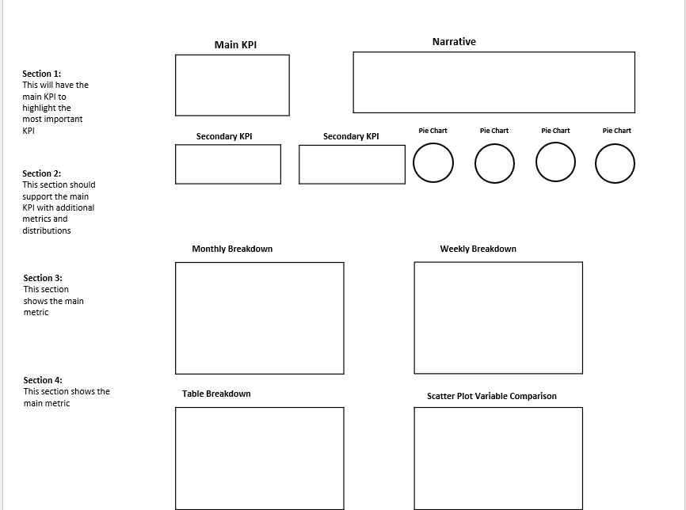
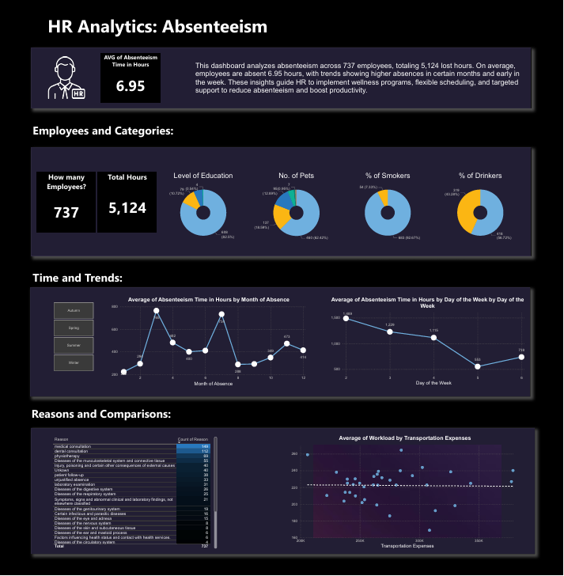

# Employee Absenteeism Analysis  

## Project Overview  
This project was developed as part of an HR request to the Data Analytics team to analyze employee absenteeism and provide actionable insights. The aim is to reduce absenteeism, improve workforce efficiency, and align compensation strategies with employee wellness.  

## Business Requests  
1. **Healthy Bonus Program** – Provide a list of healthy employees (non-smokers, non-drinkers, BMI < 25, and below-average absenteeism) eligible for a $1,000 bonus pool.  
2. **Compensation Adjustment** – Calculate an annual wage increase for non-smokers within a fixed budget of 983,221.  
3. **Absenteeism Dashboard** – Create an interactive dashboard in Power BI to visualize absenteeism trends, reasons, demographics, and risk factors based on an approved HR wireframe.  

## Data and SQL Approach  
- **Joins:** Combined absenteeism, compensation, and reasons tables into a unified dataset.  
- **Healthy Employee Filter:** Queried employees meeting health and absenteeism criteria for the bonus program.  
- **Compensation Calculation:** Allocated budget across non-smokers, resulting in an estimated **0.68 hourly increase** or **1,414 annual increase**.  
- **Data Transformation:** Added derived fields such as **BMI category** and **season of absence** for better analysis.
  

### SQL Queries  


**1. Create Join Table**  
```sql
SELECT * 
FROM absenteeism_at_work AS a
LEFT JOIN compensation AS c
    ON a.id = c.id
LEFT JOIN reasons AS r
    ON a.reason_for_absence = r.Number;
```
**2. Find the Healthiest Employees for Bonus**
```sql
SELECT *
FROM absenteeism_at_work
WHERE social_drinker = "0" 
  AND social_smoker = "0"
  AND Bodymass_index < "25" 
  AND absenteeism_time_in_hours < (
        SELECT AVG(absenteeism_time_in_hours) 
        FROM absenteeism_at_work
      );
  ```
**3. Compensation Calculation (Non-Smokers)**
```sql
SELECT COUNT(*) AS non_smokers
FROM absenteeism_at_work
WHERE social_smoker = "0";
```

**4. Optimized Query**
```sql
SELECT 
    a.ID,
    r.Reason, 
    month_of_absence,
    Bodymass_index,
    CASE 
        WHEN Bodymass_index < 18.5 THEN "Underweight"
        WHEN Bodymass_index BETWEEN 18.5 AND 25 THEN "Healthy Weight"
        WHEN Bodymass_index BETWEEN 25 AND 30 THEN "Overweight"
        WHEN Bodymass_index > 30 THEN "Obese"
        ELSE "Unknown" 
    END AS BMI_category,
    CASE 
        WHEN month_of_absence IN (12,1,2) THEN 'Winter' 
        WHEN month_of_absence IN (3,4,5) THEN 'Spring'
        WHEN month_of_absence IN (6,7,8) THEN 'Summer'
        WHEN month_of_absence IN (9,10,11) THEN 'Autumn'
        ELSE 'Unknown'
    END AS seasons_name,
    month_of_absence,
    Day_of_the_week,
    transportation_expense,
    education,
    son,
    social_drinker,
    social_smoker,
    pet,
    age,
    Workload_average_day,
    absenteeism_time_in_hours
FROM absenteeism_at_work AS a
LEFT JOIN compensation AS c
    ON a.id = c.id
LEFT JOIN reasons AS r
    ON a.reason_for_absence = r.Number;
```

### Compensation Calculation

- Budget = `983,221`
- Total working hours in a year = `2080`
- Number of non-smokers = `686`
- Total working hours of all non-smokers = `1,486,880`
- Hourly increase = `0.68`
- Annual increase per non-smoker = `1,414.4`


## Mockup Preview


## Dashboard Preview




### Dashboard Insights  
- Total employees analyzed: **737**  
- Total lost hours: **5,124**  
- Average absenteeism per employee: **6.95 hours**  
- Higher absenteeism in **Winter months** and **early weekdays**  
- Lifestyle and demographic factors (education, pets, smoking, drinking) strongly influence absenteeism patterns  
- Insights support HR in workforce planning, wellness initiatives, and absenteeism reduction strategies  

### Deliverables  
- **SQL Queries** – Data preparation and business logic  
- **Power BI Dashboard** – Visualization of absenteeism insights  
